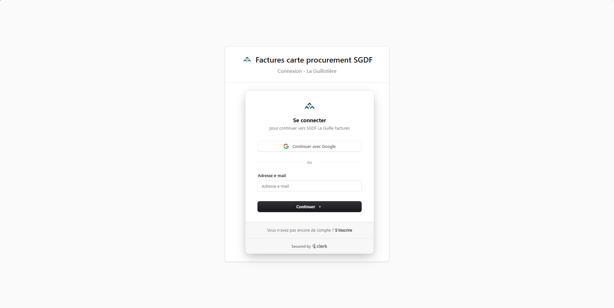

# Envoyer un justificatif

## Avant de commencer

- Vous devez appartenir à un groupe.
- Votre responsable doit avoir terminé la configuration du groupe et la trésorerie doit avoir confirmé son adresse e-mail.
- Une connexion internet est nécessaire pour l’envoi.

## Envoyer une note de frais

1. Connectez-vous et vérifiez que le bon groupe est sélectionné dans l’en-tête.
2. Prenez une photo ou importez un fichier. Les formats pris en charge sont JPG, PNG, WEBP et PDF.
3. Ajoutez si besoin d’autres justificatifs : jusqu’à 6 fichiers peuvent être envoyés ensemble.
4. Renseignez la date, l’unité, le type, le mode de paiement, le montant et une description si elle est utile.
5. Envoyez la note de frais.

Le mode de paiement est obligatoire. Choisissez entre carte bancaire, chèque, virement et espèces. Lors de l’envoi de plusieurs justificatifs, indiquez le mode de paiement de chacun.

La trésorerie reçoit l’e-mail avec les pièces jointes et vous recevez une copie pour assurer votre suivi.

## Mode hors ligne

- Ouverture de l’application déjà chargée : ✅
- Préparation du formulaire : ✅
- Envoi de l’e-mail : ❌ — une connexion est nécessaire.

## Besoin d’un accès ?

Si vous ne voyez aucun groupe, demandez à votre responsable de groupe de vous envoyer une invitation. Ne créez pas un nouveau groupe si vous êtes simplement membre.

Pour configurer un groupe ou inviter des membres, consultez le [guide des groupes](/guide/groupes).

## Modifier mon profil

Depuis « Mon compte », vous pouvez modifier votre nom et votre adresse e-mail, puis cliquer sur « Enregistrer ». Si vous changez d’adresse e-mail, un lien de confirmation est envoyé à la nouvelle adresse : elle ne sera prise en compte qu’après avoir cliqué sur ce lien.

## Changer mon mot de passe

Toujours depuis « Mon compte », section « Modifier mon mot de passe » : saisissez votre ancien mot de passe, puis le nouveau (8 caractères minimum) deux fois. Vos autres appareils seront déconnectés. Si vous vous connectez uniquement avec Google, ces sections sont remplacées par un message : votre nom, votre e-mail et votre mot de passe se gèrent depuis votre compte Google.

## Supprimer mon compte

Depuis « Mon compte », vous pouvez supprimer définitivement votre compte. Vous devez d’abord quitter tous vos groupes (« Changer de groupe », puis « Quitter »). Si vous êtes le seul responsable d’un groupe, nommez un autre responsable avant de partir. Pour confirmer, saisissez `SUPPRIMER` dans la fenêtre de confirmation. Si la suppression est refusée pour cause de session ancienne, reconnectez-vous puis réessayez.
