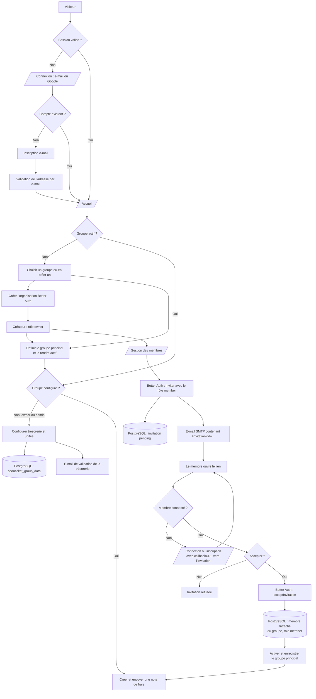
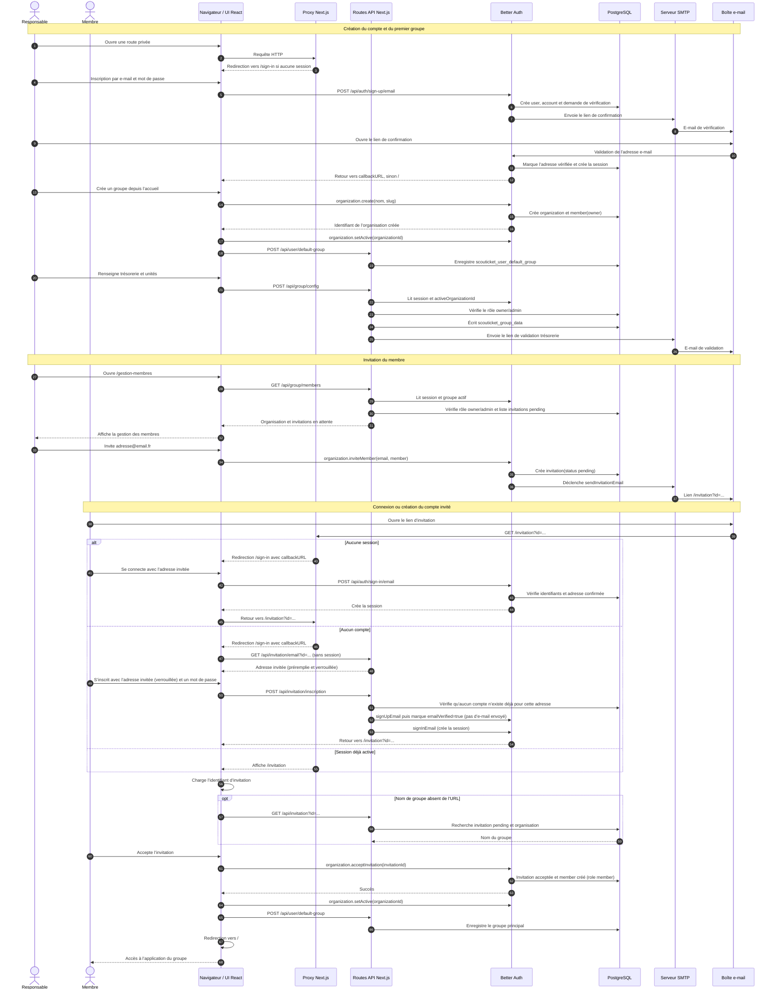

# Vue d’ensemble du projet

## Fonctionnalités principales

- Capture photo et import de justificatifs (images/PDF)
- Saisie guidée des informations de dépense
- Envoi automatique par email (trésorerie + utilisateur)
- Groupes indépendants : unités, couleurs et adresse de trésorerie propres à chaque groupe
- Validation de l’adresse de trésorerie avant le premier envoi
- Support PWA (installation écran d’accueil)
- Mode hors ligne partiel (préparation possible, envoi en ligne)

## Stack technique

- **Next.js 16** (App Router)
- **TypeScript**
- **Tailwind CSS**
- **Better Auth** pour l’authentification, les organisations et les invitations
- **SMTP / Nodemailer** pour l’envoi des emails

## Architecture simplifiée

## Séquence complète : compte, groupe et invitation

## Informations personnelles

L'application n'a pas de base de données persistante pour les justificatifs. Les pièces jointes sont transmises par e-mail et ne sont pas stockées par l’application.

Better Auth gère les comptes, les organisations, les rôles et les invitations. L’application stocke la configuration des groupes (adresse de trésorerie et état de validation) dans PostgreSQL, dans `scouticket_group_data`. Les unités de chaque groupe sont dans une table dédiée, `scouticket_unites` (une ligne par unité, clé composite `(organization_id, id)`, avec son ordre d’affichage). L’id d’une unité est un identifiant opaque généré côté base (`appliquerUnites` dans `src/lib/groupServer.ts`) au moment de sa création, jamais dérivé de son libellé : renommer une unité ne change donc jamais son id.

La nomenclature des justificatifs est aussi stockée dans `scouticket_group_data` (migration `sql/007_nomenclature_justificatifs.sql`) : `nomenclature_format` (`NULL` = le nom du fichier importé est conservé), le début et l’affichage de l’année comptable (`annee_comptable_*`) et les compteurs de numérotation `compteur_global` et `compteurs_comptables` (JSONB indexé par année de début). Ces compteurs ne contiennent ni donnée personnelle ni justificatif. Quand un format est défini, `POST /api/send-expense` calcule les noms **côté serveur** (`src/lib/nomenclature.ts` ; le client n’envoie aucun nom normalisé, seulement `originalFileName`) et réserve les numéros dans une transaction (`reserverNumeros`, verrou `FOR UPDATE` sur la ligne du groupe) qui n’est validée (`COMMIT`) qu’après l’envoi SMTP : un échec annule la réservation (`ROLLBACK`) et ne laisse aucun trou. L’année comptable et le compteur comptable dépendent de la date du justificatif, pas de la date d’envoi.

Les paramètres activables du groupe (page `/parametres-groupe`, `GET`/`PATCH /api/group/parametres`, écriture réservée aux responsables) sont aussi dans `scouticket_group_data` (migration `sql/008_parametres_groupe.sql`) : `scan_justificatifs_actif` (`false` par défaut). Il pilote le recadrage automatique des justificatifs avec Scanic, exécuté uniquement dans le navigateur (voir [Scan automatique des justificatifs](/technical/scan-justificatifs)).

Par défaut, un membre simple (rôle `member`) ne peut soumettre une dépense que pour les unités qui lui ont été explicitement attribuées par un responsable (owner/admin) depuis `/gestion-membres` ; l’absence de ligne pour une unité donnée dans `scouticket_acces_unite_membre` signifie qu’il n’y a pas accès. Les responsables (owner/admin) ne sont jamais restreints : ils ont toujours accès à toutes les unités de leur groupe, sans qu’aucune ligne ne soit nécessaire. Cette restriction est vérifiée à l’envoi d’une dépense (`POST /api/send-expense`) et lors du choix d’une unité par défaut (`POST /api/user/unit-preference`).

Depuis `/gestion-membres`, un responsable peut changer le rôle d’un autre membre (jamais le sien) via `PATCH /api/group/members/[memberId]/role`, qui délègue à Better Auth (`auth.api.updateMemberRole`, journalisé sous l’action d’audit `role_membre_modifie`). Better Auth réserve au rôle `owner` la modification du rôle d’un autre `owner` et la promotion au rang de `owner`.

Depuis la page `/compte` (lien « Mon compte »), le composant `ProfilUtilisateur` permet de modifier son profil via le client Better Auth : le nom (`clientAuth.updateUser`, action d’audit `profil_modifie`), l’adresse e-mail (`clientAuth.changeEmail`, `user.changeEmail` activé dans `src/lib/auth.ts`, action `changement_email_demande`) et le mot de passe (`clientAuth.changePassword` avec ancien mot de passe, nouveau et confirmation vérifiée côté client, les autres sessions sont révoquées, action `mot_de_passe_modifie`). Un changement d’e-mail envoie le lien de vérification habituel (`envoyerEmailVerificationCompte`) à la nouvelle adresse : l’adresse du compte ne change qu’après clic sur ce lien. `ProfilUtilisateur` appelle `clientAuth.listAccounts()` : si aucun compte lié n’a le `providerId` `credential` (connexion Google uniquement), les formulaires sont masqués et remplacés par un encart indiquant que le profil se gère depuis le compte Google ; en cas d’échec de cet appel, les formulaires restent affichés.

Depuis cette même page, un utilisateur peut supprimer son compte via `clientAuth.deleteUser` (`user.deleteUser` de Better Auth, journalisé sous l’action d’audit `compte_supprime`). Le dialog exige la saisie exacte de `SUPPRIMER`. Le blocage est appliqué côté serveur par `verifierSuppressionCompte` (`src/lib/suppressionCompte.ts`, hook `beforeDelete`) : tant que l’utilisateur est membre d’un groupe, la suppression est refusée (409) et il doit d’abord quitter chaque groupe à la main. Comme le dernier responsable d’un groupe ne peut pas le quitter, un groupe ne se retrouve jamais sans responsable. Better Auth exige une session récente (`session.freshAge`) ; sinon l’utilisateur doit se reconnecter. La suppression du compte entraîne en cascade celle de ses sessions, comptes liés, préférences d’unité, groupe par défaut et accès aux unités.

La préférence de groupe principal est stockée séparément dans `scouticket_user_default_group`. Après l’acceptation d’une invitation, le groupe rejoint devient automatiquement le groupe actif et principal du membre.

Un utilisateur peut appartenir à plusieurs groupes simultanément (plusieurs lignes `member`) ; `scouticket_user_default_group` ne fait que retenir lequel afficher par défaut, sans jamais retirer l’accès aux autres groupes.

Lors d’une inscription via un lien d’invitation, l’adresse e-mail est préremplie et verrouillée avec l’adresse invitée (`GET /api/invitation/email`, sans authentification) et la vérification d’e-mail habituelle est sautée : `POST /api/invitation/inscription` crée le compte, marque directement `emailVerified = true` en base puisque l’ouverture du lien d’invitation prouve déjà la possession de l’adresse, puis connecte l’utilisateur. Une inscription classique (hors invitation) continue de recevoir l’e-mail de vérification comme avant.
